# Copilot-Agent Route Flow Diagram

## Overview
This diagram illustrates the complete flow of a request through the `/copilot-agent` route from initial request to final response.

## Flow Diagram

```mermaid
flowchart TD
    Start([HTTP POST Request to /copilot-agent]) --> Auth[Authentication Middleware]
    Auth --> |Valid Token| RouteHandler[Route Handler: /copilot-agent]
    Auth --> |Invalid| AuthError([401 Unauthorized])
    
    RouteHandler --> ValidateFields{Validate Required Fields<br/>query, model, user_id}
    ValidateFields --> |Missing| BadRequest([400 Bad Request])
    ValidateFields --> |Valid| ExtractParams[Extract Parameters:<br/>- query<br/>- model<br/>- session_id<br/>- user_id<br/>- system_prompt<br/>- save_chat<br/>- include_history<br/>- auth_token<br/>- stream default=true<br/>- max_iterations from config]
    
    ExtractParams --> CheckStream{stream !== false?}
    
    CheckStream --> |Streaming Mode| SetupSSE[Setup SSE Headers:<br/>- Content-Type: text/event-stream<br/>- Cache-Control: no-cache<br/>- Connection: keep-alive<br/>- X-Accel-Buffering: no]
    CheckStream --> |Non-Streaming| NonStreamPath[Non-Streaming Path]
    
    SetupSSE --> FlushHeaders[Flush Headers to Client]
    FlushHeaders --> CallAgentStream[Call AgentOrchestrator.executeAgentLoop<br/>with stream=true, responseStream]
    NonStreamPath --> CallAgent[Call AgentOrchestrator.executeAgentLoop<br/>with stream=false]
    
    CallAgentStream --> AgentLoop
    CallAgent --> AgentLoop
    
    %% Agent Orchestrator Loop
    AgentLoop[Agent Orchestrator: executeAgentLoop] --> InitAgent[Initialize Agent:<br/>- Create logger with session_id<br/>- Start new query<br/>- Initialize executionTrace array<br/>- Initialize toolResults object<br/>- Initialize collectedRagDocs array<br/>- Set iteration = 0]
    
    InitAgent --> LoadSession{session_id exists?}
    LoadSession --> |Yes| GetSession[Get Chat Session from DB]
    LoadSession --> |No| CreateUserMsg
    GetSession --> CheckHistory{include_history?}
    CheckHistory --> |Yes| LoadHistory[Load message history<br/>from session]
    CheckHistory --> |No| CreateUserMsg
    LoadHistory --> CreateUserMsg[Create User Message Object:<br/>- message_id: UUID<br/>- role: 'user'<br/>- content: query<br/>- timestamp: now]
    
    CreateUserMsg --> IterationLoop{iteration < max_iterations?}
    
    %% Iteration Loop
    IterationLoop --> |Yes| IncrementIter[iteration++]
    IterationLoop --> |No| MaxIterReached[Max Iterations Reached]
    
    IncrementIter --> PlanAction[Plan Next Action:<br/>- Load available tools<br/>- Format execution trace<br/>- Format tool results<br/>- Call LLM with planning prompt<br/>- Parse JSON response]
    
    PlanAction --> EmitToolSelected{Streaming?}
    EmitToolSelected --> |Yes| SendToolSSE[Emit SSE Event: 'tool_selected'<br/>with iteration, tool, reasoning, parameters]
    EmitToolSelected --> |No| CheckDuplicate
    SendToolSSE --> CheckDuplicate
    
    CheckDuplicate{Is Duplicate Action?<br/>Check against executionTrace}
    CheckDuplicate --> |Yes, Duplicate| HasSufficientData{Has Sufficient Data?}
    CheckDuplicate --> |No| AddToTrace
    
    HasSufficientData --> |Yes| ForceFinalizeMsg[Force FINALIZE:<br/>Override action to FINALIZE<br/>Emit 'forced_finalize' SSE event]
    HasSufficientData --> |No| AddWarning[Add DUPLICATE_DETECTED<br/>warning to trace<br/>Continue to next iteration]
    AddWarning --> IterationLoop
    ForceFinalizeMsg --> AddToTrace
    
    AddToTrace[Add to Execution Trace:<br/>- iteration<br/>- action<br/>- reasoning<br/>- parameters<br/>- timestamp]
    
    AddToTrace --> IsFinalize{action == 'FINALIZE'?}
    
    IsFinalize --> |Yes| GenerateFinal[Generate Final Response]
    IsFinalize --> |No| ExecuteTool[Execute Tool<br/>via executeMcpTool]
    
    ExecuteTool --> PrepareResult[Prepare Tool Result:<br/>- Check if RAG result<br/>- Extract documents & summary<br/>- Store RAG docs separately<br/>- Create safe result for LLM]
    
    PrepareResult --> ToolSuccess{Tool Execution<br/>Success?}
    
    ToolSuccess --> |Yes| LogSuccess[Log Tool Execution:<br/>- Update trace entry with result<br/>- Add to toolResults<br/>- Emit 'tool_executed' SSE event]
    ToolSuccess --> |No| LogFailure[Log Tool Failure:<br/>- Update trace entry with error<br/>- Add error to toolResults<br/>- Emit 'tool_executed' SSE event]
    
    LogSuccess --> IsFinalizeTool{Is Finalize-Category Tool?<br/>e.g., RAG tools}
    IsFinalizeTool --> |Yes| HasSummary{Result has summary?}
    IsFinalizeTool --> |No| IterationLoop
    
    HasSummary --> |Yes| UseSummary[Use summary as finalResponse<br/>Emit 'final_response' SSE<br/>Break loop]
    HasSummary --> |No| GenerateFinal
    
    LogFailure --> HandleError[Handle Tool Error:<br/>- Check if critical error<br/>- Check consecutive failures<br/>- Decide continue/stop]
    
    HandleError --> ShouldContinue{Should Continue?}
    ShouldContinue --> |Yes| IterationLoop
    ShouldContinue --> |No| GenerateFinal
    
    %% Final Response Generation
    MaxIterReached --> GenerateFinal
    UseSummary --> SaveChat
    
    GenerateFinal --> CheckToolResults{Has Tool Results?}
    CheckToolResults --> |Yes| ToolBasedResponse[Format Tool-Based Response:<br/>- Format execution trace<br/>- Format tool results<br/>- Build finalResponse prompt]
    CheckToolResults --> |No| DirectResponse[Format Direct Response:<br/>- Use directResponse prompt<br/>- Include conversation history]
    
    ToolBasedResponse --> QueryLLM
    DirectResponse --> QueryLLM
    
    QueryLLM[Query LLM for Final Response] --> StreamOrNot{Streaming?}
    StreamOrNot --> |Yes| StreamResponse[Stream Response via SSE:<br/>- Emit 'final_response' events<br/>- Accumulate fullResponse]
    StreamOrNot --> |No| GetFullResponse[Get Full Response]
    
    StreamResponse --> CreateMessages
    GetFullResponse --> CreateMessages
    
    %% Save to Database
    CreateMessages[Create Message Objects:<br/>- assistantMessage with finalResponse<br/>- systemMessage with agent_trace<br/>- Add RAG docs to dbSystemMessage]
    
    CreateMessages --> SaveChat{save_chat && session_id?}
    SaveChat --> |Yes| CreateSession{Session exists?}
    SaveChat --> |No| ReturnResponse
    
    CreateSession --> |No| CreateNewSession[Create Chat Session in DB]
    CreateSession --> |Yes| SaveMessages
    CreateNewSession --> SaveMessages
    
    SaveMessages[Save Messages to Session:<br/>- userMessage<br/>- dbSystemMessage with docs<br/>- assistantMessage]
    
    SaveMessages --> SaveComplete[Log: Messages Saved]
    SaveComplete --> ReturnResponse
    
    %% Final Response
    ReturnResponse{Streaming?}
    ReturnResponse --> |Yes| EmitDone[Emit SSE 'done' event:<br/>- iterations<br/>- tools_used<br/>- message_id<br/>End SSE stream]
    ReturnResponse --> |No| JSONResponse[Return JSON Response:<br/>- message: 'success'<br/>- userMessage<br/>- assistantMessage<br/>- systemMessage<br/>- agent_metadata]
    
    EmitDone --> StreamEnd([Stream Ended])
    JSONResponse --> ResponseEnd([200 OK])
    
    %% Error Handling
    RouteHandler -.-> ErrorCatch[Catch Errors]
    AgentLoop -.-> ErrorCatch
    ErrorCatch --> IsStreamError{Streaming?}
    IsStreamError --> |Yes| SSEError[Send SSE 'error' event<br/>End stream]
    IsStreamError --> |No| JSONError[Return 500 JSON Error]
    SSEError --> ErrorEnd([Error Response Sent])
    JSONError --> ErrorEnd
    
    style Start fill:#e1f5ff
    style ResponseEnd fill:#c8e6c9
    style StreamEnd fill:#c8e6c9
    style ErrorEnd fill:#ffcdd2
    style AuthError fill:#ffcdd2
    style BadRequest fill:#ffcdd2
    style AgentLoop fill:#fff9c4
    style IterationLoop fill:#ffe0b2
    style GenerateFinal fill:#f8bbd0
```



## Key Components

### 1. **Route Handler** (`chatRoutes.js:82-195`)
- Receives POST request at `/copilot-api/chatbrc/copilot-agent`
- Validates required fields: `query`, `model`, `user_id`
- Extracts parameters with defaults
- Sets up SSE headers for streaming or prepares for JSON response

### 2. **Authentication Middleware** (`middleware/auth.js`)
- Validates authorization token
- Uses `p3-user/validateToken` with signing subject URL
- Sets `req.user` if valid

### 3. **Agent Orchestrator** (`services/agentOrchestrator.js`)
- Main orchestration logic in `executeAgentLoop`
- Manages iterative agent execution
- Key features:
  - **Duplicate Detection**: Prevents redundant tool executions
  - **Tool Execution**: Via MCP (Model Context Protocol) executor
  - **RAG Document Collection**: Handles RAG results separately
  - **Streaming Support**: Emits SSE events during execution

### 4. **Iterative Agent Loop**
Each iteration includes:
1. **Plan Next Action**: LLM decides next tool to use
2. **Duplicate Check**: Validates against execution history
3. **Tool Execution**: Calls appropriate MCP tool
4. **Result Processing**: Handles success/failure, RAG results
5. **Finalization Check**: Determines if ready to respond

### 5. **Tool Categories**
- **Finalize Tools**: Automatically trigger final response (e.g., RAG tools)
- **Data Tools**: Query BV-BRC collections, file operations
- **FINALIZE Action**: Explicit finalization by planner

### 6. **Final Response Generation**
Two paths:
- **Direct Response**: No tools used, conversational reply
- **Tool-Based Response**: Synthesizes tool results into answer

### 7. **Database Persistence**
- Creates/updates chat session
- Saves messages with metadata:
  - User message
  - System message (with agent trace and RAG docs)
  - Assistant message
- Maintains conversation history

### 8. **Response Formats**

**Streaming (SSE Events):**
- `tool_selected`: When planner chooses a tool
- `duplicate_detected`: When duplicate action detected
- `forced_finalize`: When forcing finalization
- `tool_executed`: After tool execution
- `final_response`: Streaming final answer chunks
- `done`: Completion metadata
- `error`: Error information

**Non-Streaming (JSON):**
```json
{
  "message": "success",
  "userMessage": {...},
  "assistantMessage": {...},
  "systemMessage": {...},
  "agent_metadata": {
    "iterations": 3,
    "tools_used": 2,
    "execution_trace": [...]
  }
}
```

## Configuration

**Max Iterations**: Defined in `config.json` under `agent.max_iterations` (default: 8)

**RAG Settings**: Defined in MCP config under `global_settings.rag_max_docs`

**Auth Token**: Can be passed in request or read from MCP config

## Error Handling

- **Tool Errors**: Agent attempts recovery, continues if possible
- **Critical Errors**: Stops execution, generates response with partial results
- **Consecutive Failures**: After 2 consecutive failures, stops and finalizes
- **Streaming Errors**: Sent via SSE `error` event
- **Non-Streaming Errors**: Returned as 500 JSON response

